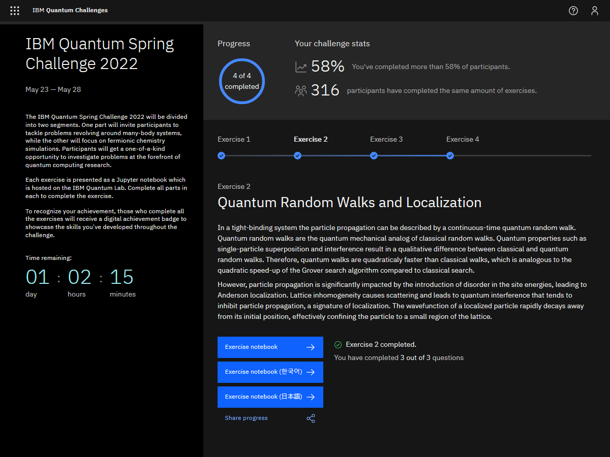
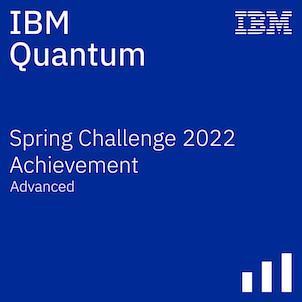

# IBM Quantum Spring Challenge 2022  
  
These are the solutions I submitted for the [IBM Quantum Spring Challenge 2022](https://research.ibm.com/blog/quantum-spring-challenge-2022)  
The original challenge repository is at [/qiskit-community/ibm-quantum-spring-challenge-2022](https://github.com/qiskit-community/ibm-quantum-spring-challenge-2022)  
  
## Challenge Details  
__Site:__ [challenges.quantum-computing.ibm.com/spring-2022](https://challenges.quantum-computing.ibm.com/spring-2022)  
__Date:__ May 2022  
  
## Certificate  
Here's a screenshot of my challenge portal dashboard.  
  
  
And here's my advanced badge, for completing all the exercises.  
  
  
## Description  
The challenge consisted of 4 exercises, in each `exercise<x>` folder.  
Each folder has a short `index.md` introduction, a `.ipynb` workbook, and a `.html` copy of the workbook.  
There are also several pictures in the folders, used in the workbooks.  
  
## Topics  
[`exercise1`](exercise1/01.CM_trotterization.ipynb) - Tight Binding Model  
[`exercise2`](exercise2/02.QRW_and_localization.ipynb) - Quantum Random Walk & Localisation  
[`exercise3`](exercise3/03.many_body_localization.ipynb) - Many Body Localisation  
[`exercise4`](exercise4/04.quantum_chemistry.ipynb) - Variational Quantum Eigensolver  